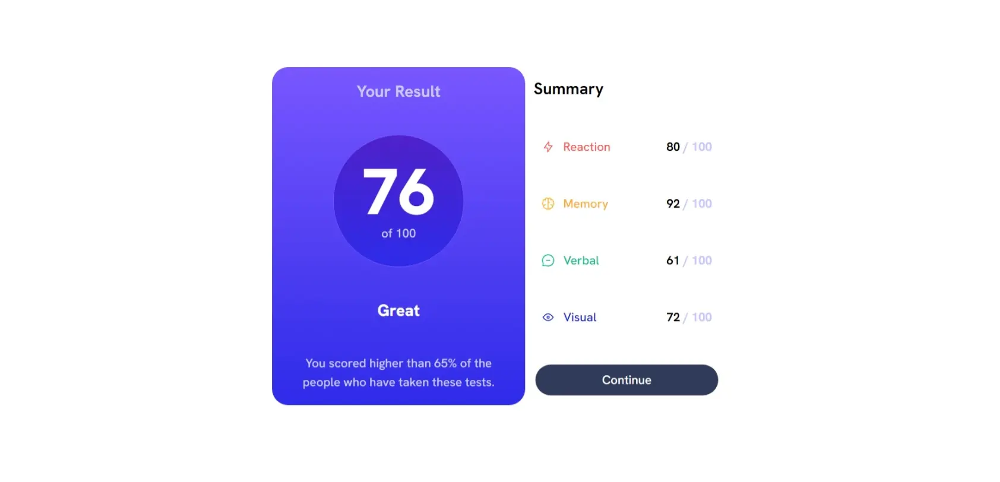

# Frontend Mentor - Results summary component solution

This is a solution to the [Results summary component challenge on Frontend Mentor](https://www.frontendmentor.io/challenges/results-summary-component-CE_K6s0maV). Frontend Mentor challenges help you improve your coding skills by building realistic projects. 

## Table of contents

- [Overview](#overview)
  - [The challenge](#the-challenge)
  - [Screenshot](#screenshot)
  - [Links](#links)
- [My process](#my-process)
  - [Built with](#built-with)
  - [What I learned](#what-i-learned)
  - [Useful resources](#useful-resources)
- [Author](#author)

## Overview

### The challenge

Users should be able to:

- View the optimal layout for the interface depending on their device's screen size
- See hover and focus states for all interactive elements on the page

### Screenshot

### Links

- Solution URL: [GitHub](https://github.com/TuanAnh45468/result-summary-component)
- Live Site URL: [Netlify](https://result-summary-component-tuananh.netlify.app/)

## My process

### Built with

- Semantic HTML5 markup
- CSS custom properties
- Flexbox
- Mobile-first workflow
- [TailwindCSS](https://tailwindcss.com) - For styles

### What I learned

In this challenge I learn how to use flexbox
### Useful resources

- [TailwindCSS cheatsheet](https://tailwindcomponents.com/cheatsheet/)

## Author

- Website - [My portfolio](https://tuananhportfolio.netlify.app/)
- Frontend Mentor - [@Tuananh45468](https://www.frontendmentor.io/profile/Tuananh45468)